# KAYART - Ứng Dụng Vẽ Cộng Tác Thời Gian Thực

> KayArt là đồ án môn học NT106 – Lập trình mạng căn bản, ứng dụng vẽ và cộng tác nghệ thuật cho phép nhiều người dùng sáng tạo cùng lúc trên một Canvas với sự hỗ trợ của AI.

<p align="center">
  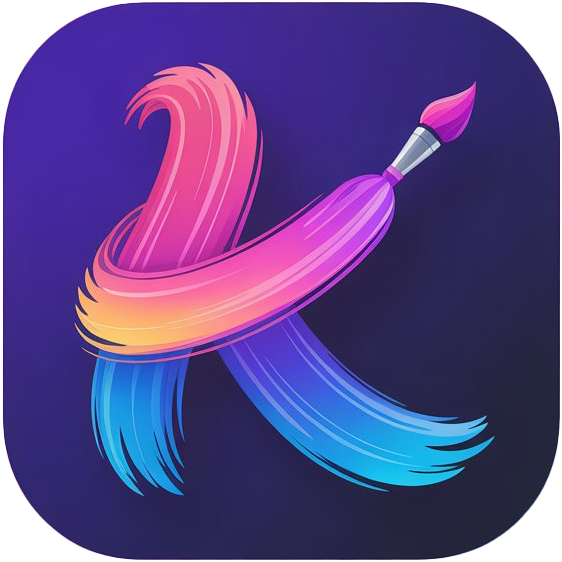
  <br>
  <i>Sáng tạo nghệ thuật cùng nhau trong thời gian thực</i>
  <br>
  
  
  
  
</p>


## 🏫 Thông Tin Đồ Án

* **Môn học:** Lập trình mạng căn bản (NT106)
* **Trường:** Đại học Công nghệ Thông tin (UIT)
* **Giảng viên hướng dẫn:** ThS. Lê Minh Khánh Hội
* **Nhóm thực hiện:** Nhóm 3

## 👥 Thành Viên Nhóm

| STT | MSSV | Họ và tên | Vai trò |
|:---:|:---:|:---|:---:|
| 1 | 24520048 | **Huỳnh Phước An** | **Team Leader** |
| 2 | 24520043 | Hà Nguyễn Hiếu An | Member |
| 3 | 24520054 | Nguyễn Chiêu Ân | Member |
| 4 | 24520919 | Võ Tưởng Tuấn Kiệt | Member |

## 📌 Mục lục
* [Giới thiệu](#-giới-thiệu-về-kayart)
* [Công nghệ sử dụng](#-công-nghệ-sử-dụng)
* [Kiến trúc hệ thống](#-kiến-trúc-hệ-thống)
* [Tính năng nổi bật](#-tính-năng-nổi-bật)
* [Cài đặt](#-cài-đặt--chạy-ứng-dụng)
* [Hình ảnh Demo](#-hình-ảnh-demo)

## 🎨 Giới Thiệu Về KayArt
> **Điểm nổi bật:** Đồng bộ hóa nét vẽ thông qua Socket với độ trễ thấp và tối ưu hóa bằng Redis Cache.  
> **Mục tiêu:** ***SÁNG TẠO NGHỆ THUẬT CÙNG NHAU TRONG THỜI GIAN THỰC*** 🎨✨

KayArt là nền tảng vẽ cộng tác, nơi nghệ sĩ, người dùng yêu thích nghệ thuật, người dùng đại trà có thể kết nối, sáng tạo và chia sẻ tác phẩm/dự án của mình.

1. **Kết nối:** Đăng nhập và kết nối với bạn bè, cộng đồng người dùng cùng nhu cầu trên nền tảng.
2. **Tạo phòng:** Khởi tạo không gian vẽ mới hoặc tham gia phòng có sẵn để cộng tác.
3. **Sáng tạo:** Sử dụng bộ công cụ vẽ đa dạng từ cơ bản đến nâng cao, với sự hỗ trợ của AI.
4. **Tương tác:** Trò chuyện và trao đổi ý tưởng với các thành viên trong phòng.
5. **Đồng bộ:** Mọi nét vẽ được cập nhật thời gian thực cho tất cả thành viên.
6. **Chia sẻ:** Xuất, lưu tác phẩm/dự án hoàn thành về máy của bạn và chia sẻ với bạn bè.

## 🛠 Công Nghệ Sử Dụng
| Thành phần | Công nghệ | 
| :--- | :--- |
| **Ngôn ngữ** | C# (.NET 8.0 WinForms) |
| **Giao thức mạng** | TCP/UDP Sockets, JSON Serialization |
| **Cơ sở dữ liệu** | SQL Server, Redis (Caching) |
| **Xác thực & Bảo mật** | JWT, Firebase Auth, Google Vault, reCAPTCHA |
| **Quản lí Secret** | Google Secret Manager |
| **AI** | Stable Diffusion API Integration |
| **Môi trường phát triển** | Visual Studio 2022+ |
| **Quản lí mã nguồn** | Git & GitHub |

## 🏗 Kiến Trúc Hệ Thống
Hệ thống được thiết kế theo mô hình **Client-Server**, xử lý đồng bộ đa luồng:

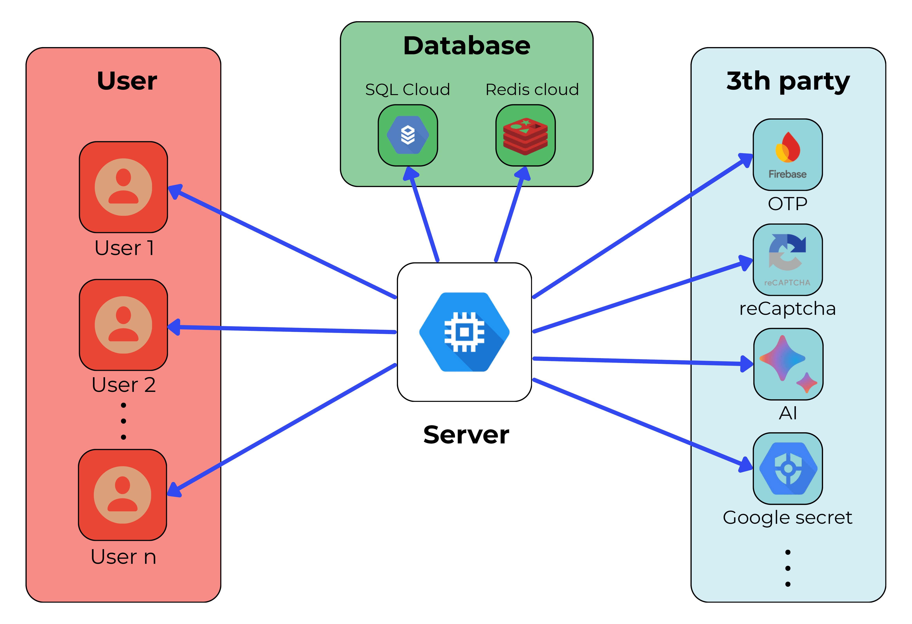  
*(Mô tả: Server điều phối các gói tin vẽ từ Client A đến tất cả Client khác trong phòng)*

## 🌐 Network Stack & Communication Protocol

Hệ thống truyền tải dữ liệu dựa trên kiến trúc phân lớp, tối ưu hóa cho việc truyền tải các gói tin vẽ (Drawing Packets) với tần suất cao.

|  Network Stack |
| :---: |
| 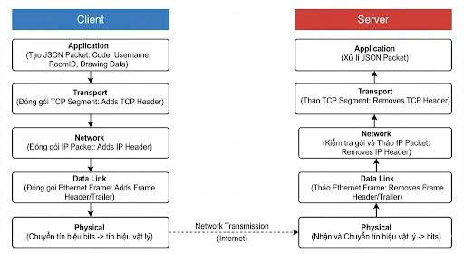 |

### 1. Phân Lớp Giao Thức (Network Layers)
| Lớp | Công nghệ sử dụng | Mô tả |
| :--- | :--- | :--- |
| **Application Layer** | **JSON Serialization** | Định dạng dữ liệu trao đổi giữa Client và Server |
| **Presentation Layer** | **Newtonsoft.Json** | Mã hóa và giải mã đối tượng C# sang chuỗi JSON |
| **Transport Layer** | **TCP & UDP Sockets** | ***TCP:*** Đảm bảo độ tin cậy cho Auth/Room. ***UDP:*** Tối ưu tốc độ cho nét vẽ |
| **Network Layer** | **IPv4 / DNS** | Định danh và điều hướng gói tin trong mạng |

### 2. Cấu Trúc Gói Tin (Packet Structure)
Mọi thông tin trao đổi đều được đóng gói dưới dạng JSON:
```json
{
  {
  "Code": 6,
  "LoginUsername": "ten-nguoi-dung",
  "LoginPassword": "mat-khau-nguoi-dung",
  "CaptchaToken": "token-xac-thuc",
  ...
  }
}
```

## 🌟 Tính Năng Nổi Bật

### 👤 Quản Lý Người Dùng
* ***Đăng nhập & Đăng ký:*** Hệ thống xác thực an toàn với JWT và Firebase.
* ***Khôi phục mật khẩu:*** Tính năng quên mật khẩu với xác thực OTP qua email.
* ***Quản lý hồ sơ:*** Cập nhật thông tin cá nhân và cài đặt tài khoản.
* ***Danh sách bạn bè:*** Kết nối và xem trạng thái online của bạn bè.

### 🎮 Hệ Thống Phòng Vẽ
* ***Tạo phòng mới:*** Khởi tạo canvas trắng và mời bạn bè tham gia.
* ***Tham gia phòng:*** Tìm kiếm và gia nhập các phòng vẽ có sẵn.
* ***Quản lý thành viên:*** Hiển thị danh sách người dùng trong phòng theo thời gian thực.
* ***Chat trong phòng:*** Trò chuyện trực tuyến với các thành viên khác.

### 🖌️ Công Cụ Vẽ
* ***Công cụ cơ bản:*** Bút vẽ, tẩy, hình dạng cơ bản (đường thẳng, hình tròn, hình chữ nhật).
* ***Công cụ nâng cao:*** Màu sắc tùy chỉnh, độ dày nét vẽ, độ trong suốt.
* ***Hỗ trợ AI ✨:*** Tính năng AI để vẽ tự động, chỉnh sửa và cải thiện hình ảnh.
* ***Layer management:*** Quản lý các lớp vẽ độc lập.

### ⚡ Đồng Bộ Thời Gian Thực
* ***Real-time Drawing:*** Mọi nét vẽ được đồng bộ ngay lập tức cho tất cả người dùng.
* ***Sync on Join:*** Người dùng mới tự động nhận toàn bộ nội dung canvas hiện tại.
* ***Optimized Performance:*** Sử dụng Redis cache để tối ưu hiệu suất đồng bộ.

### 💾 Lưu Trữ & Xuất
* ***Lưu tác phẩm:*** Lưu trữ bản vẽ trên server với khả năng tải lại.
* ***Xuất file:*** Xuất canvas dưới dạng PNG.
* ***Lịch sử:*** Xem lại các tác phẩm đã tạo và lịch sử phòng vẽ.

### 🔒 Bảo Mật
* ***JWT Authentication:*** Xác thực token an toàn cho mọi request.
* ***Firebase Integration:*** Quản lý người dùng và xác thực đa nền tảng.
* ***reCAPTCHA:*** Bảo vệ khỏi bot và spam.
* ***Secret Management:*** Bảo mật thông tin nhạy cảm với Vault/Google Secret Manager.

## 📋 Yêu Cầu Hệ Thống

* .NET 8.0 SDK trở lên
* Microsoft SQL Server hoặc SQL LocalDB
* Redis Server (cho caching)
* Visual Studio 2022 (khuyến nghị) hoặc IDE tương tự
* Kết nối Internet (cho tính năng AI và Firebase)

## 🚀 Cài Đặt & Chạy Ứng Dụng

### Bước 1: Clone Repository
```bash
git clone https://github.com/your-repo/kayart.git
cd kayart
```

### Bước 2: Cài Đặt Dependencies
Mở solution trong Visual Studio và restore NuGet packages:
```bash
dotnet restore
```

### Bước 3: Cấu Hình Database
1. Mở file `Server/appsettings.json`
2. Cập nhật connection string cho SQL Server:
```json
{
  "ConnectionStrings": {
    "DefaultConnection": "Server=(localdb)\\mssqllocaldb;Database=KayArtDB;Trusted_Connection=True;"
  }
}
```

### Bước 4: Chạy Database Scripts
Thực thi các script SQL trong thư mục `Database/` để tạo schema và dữ liệu mẫu.

### Bước 5: Cấu Hình Redis
Đảm bảo Redis Server đang chạy trên localhost:6379 hoặc cập nhật cấu hình trong `appsettings.json`.

### Bước 6: Cấu Hình API Keys
Thêm các API keys cần thiết vào `appsettings.json` hoặc Secret Manager:
- Firebase credentials
- reCAPTCHA keys
- AI service keys (nếu có)

### Bước 7: Chạy Ứng Dụng
1. Chạy **Server** trước:
```bash
cd Server
dotnet run
```

2. Sau đó chạy **Client**:
```bash
cd Client
dotnet run
```

## 📸 Hình Ảnh Demo

### 🔐 Xác Thực & Quản Lý Tài Khoản
| Đăng nhập | Đăng ký |
| :---: | :---: |
| 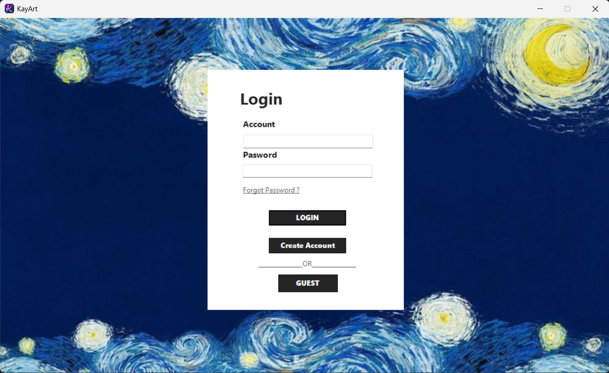 | 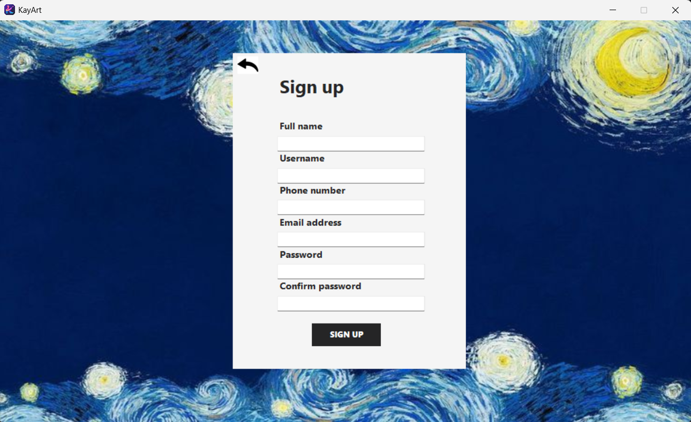 |

| Quên mật khẩu | Xác thực OTP | Đặt lại mật khẩu |
| :---: | :---: |:---: |
| 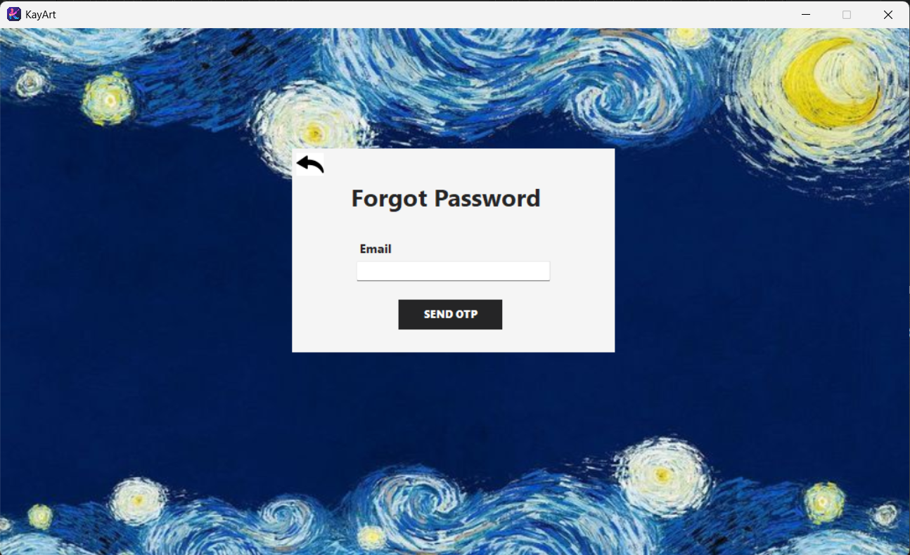 | 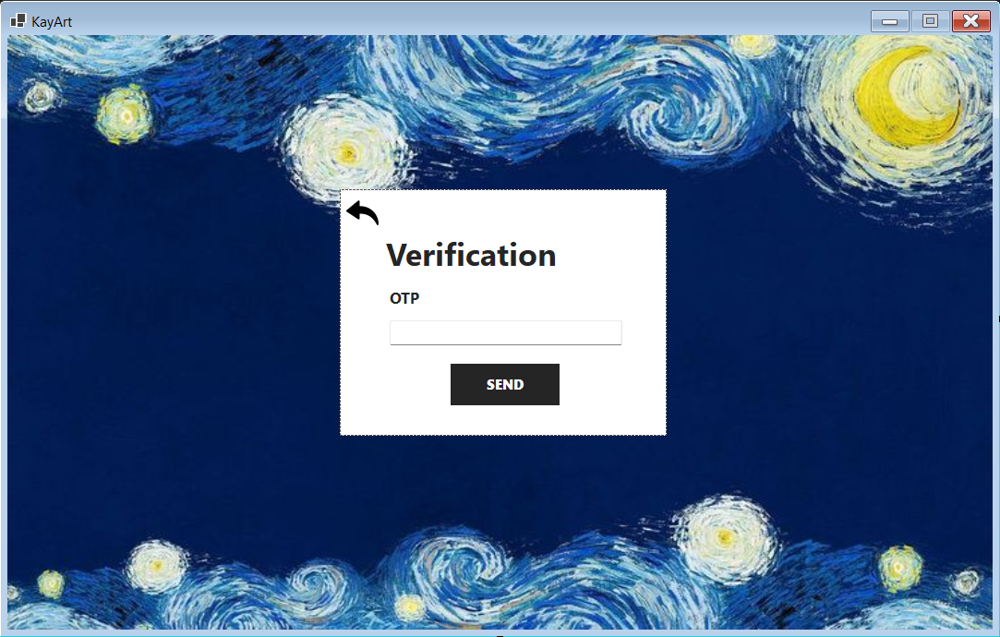 | 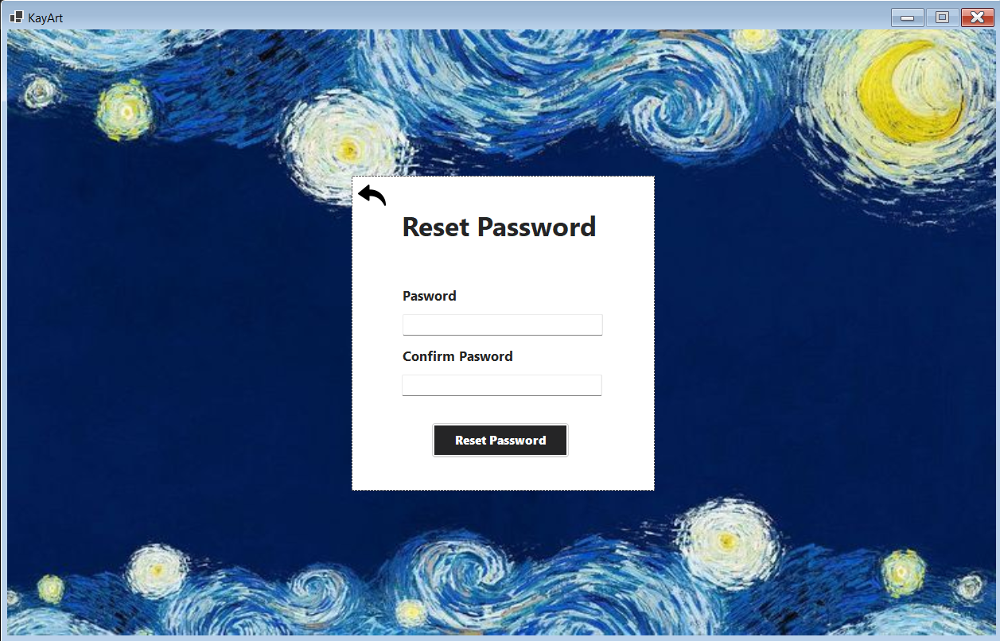 |

---

### 🏠 Dashboard & Danh Sách Phòng
| Dashboard chính | Danh sách phòng vẽ |
| :---: | :---: |
| 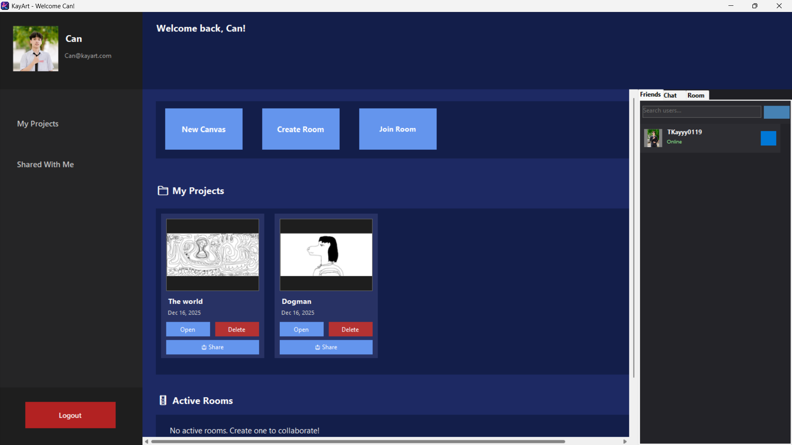 | 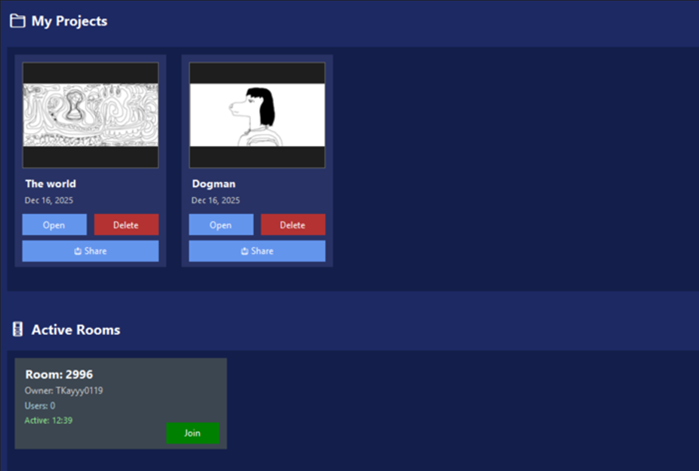 |

---

### 🎨 Giao Diện Vẽ
| Canvas với công cụ vẽ |
| :---: |
| 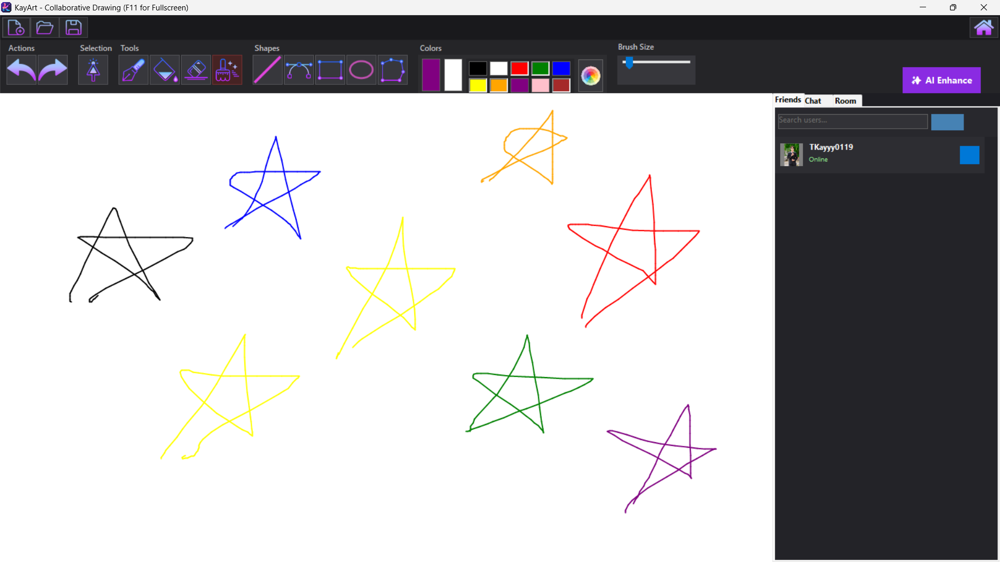 |

---

### 👥 Tính Năng Cộng Tác
| Chat trong phòng | Danh sách thành viên |
| :---: | :---: |
| 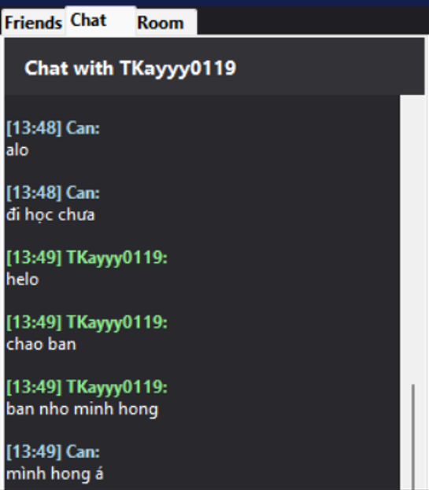 | 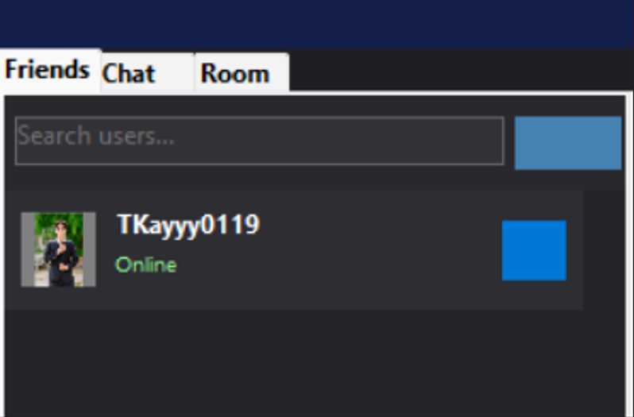 |

---

### ✨ Tính Năng AI 
| Demo AI |
| :---: |
| 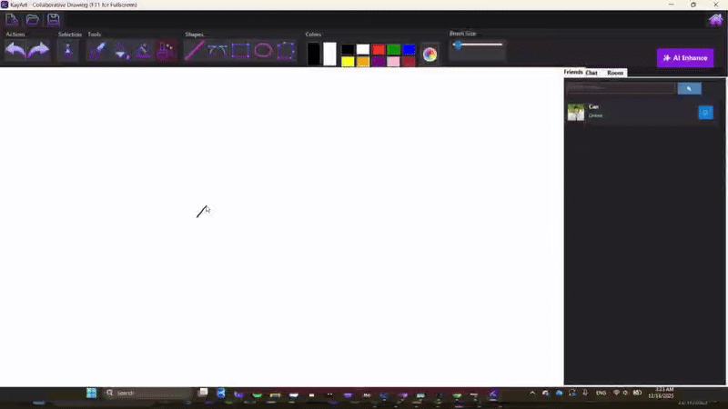 |


## 📚 Tài Liệu
### 1. Kiến Trúc Hệ Thống
KayArt vận hành theo mô hình **Client-Server** đa luồng. Server đóng vai trò trung tâm điều phối, trong khi Client xử lý giao diện người dùng và tương tác Canvas.
* **Server:** Xử lý kết nối (Socket), quản lý phòng, xác thực người dùng và lưu trữ dữ liệu.
* **Client:** Render nét vẽ bằng GDI+, gửi/nhận gói tin và tích hợp AI cho xử lý hình ảnh.

### 2. Luồng Dữ Liệu Đồng Bộ (Data Flow)
Để đảm bảo trải nghiệm vẽ "thời gian thực", hệ thống sử dụng cơ chế **Broadcasting** qua Socket:
* **Độ trễ tối thiểu:** Sử dụng Redis Cache để lưu tạm các nét vẽ hiện hành trước khi ghi vào Database chính.
* **Cơ chế Sync on Join:** Khi người dùng mới tham gia, Server sẽ gửi toàn bộ lịch sử nét vẽ trong phòng đó từ Redis/DB để Client mới vẽ lại toàn bộ Canvas.

### 3. Lược Đồ Cơ Sở Dữ Liệu
Hệ thống sử dụng SQL Server để quản lý các thực thể quan trọng và mối quan hệ giữa chúng.
* **Users & Friends:** Quản lý thông tin cá nhân và mạng xã hội thu nhỏ.
* **Rooms & Participants:** Quản lý phiên làm việc cộng tác.
* **Drawing:** Lưu trữ dữ liệu nét vẽ dưới dạng vector để có thể tái tạo lại hình ảnh bất cứ lúc nào.

| Cơ Sở Dữ Liệu | 
| :---: | 
| 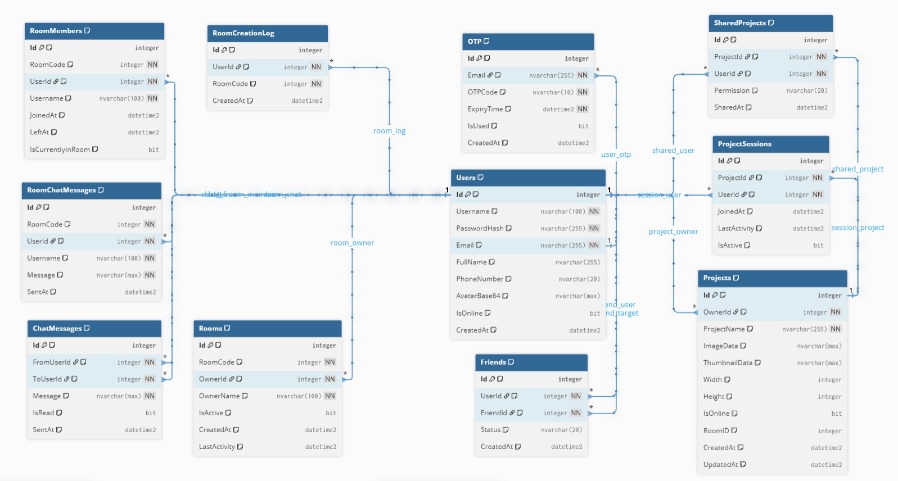 | 

## 🤝 Đóng Góp
Chúng tôi hoan nghênh mọi đóng góp cho Ứng dụng và rất vui mừng được chào đón bạn! Vui lòng làm theo các bước sau để đóng góp:
1. Fork repository
2. Tạo branch mới (`git checkout -b feature/AmazingFeature`)
3. Commit changes (`git commit -m 'Add some AmazingFeature'`)
4. Push to branch (`git push origin feature/AmazingFeature`)
5. Tạo Pull Request

## 📝 License

Dự án này được phát triển cho mục đích học tập tại Đại học Công nghệ Thông tin (UIT).

## 🙏 Lời Cảm Ơn

- Cảm ơn giảng viên Ths. Lê Minh Khánh Hội đã hướng dẫn đã hỗ trợ trong quá trình phát triển
- Cảm ơn các thư viện mã nguồn mở đã được sử dụng trong dự án
- Cảm ơn cộng đồng .NET và các diễn đàn lập trình đã cung cấp tài nguyên hữu ích

---

<p align="center">
  <b>KAYART</b> stands for <b>K</b>eep <b>A</b>ll <b>Y</b>our <b>A</b>bstract <b>R</b>eal-time <b>T</b>houghts <br>
  <strong>Made with ❤️ by KayArt Team</strong>
</p>